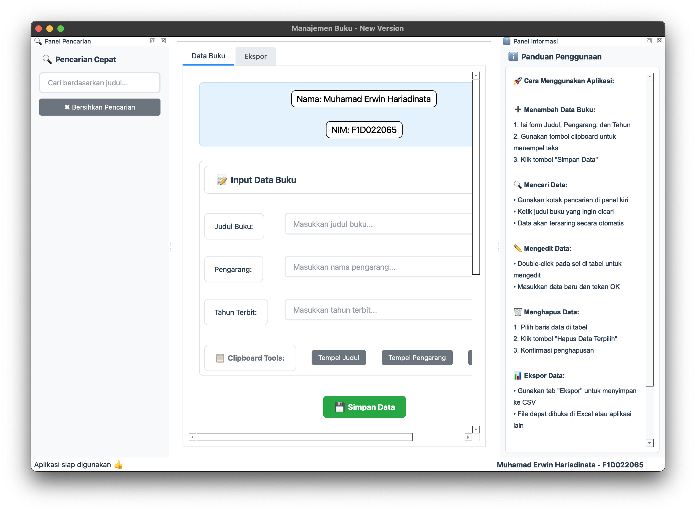
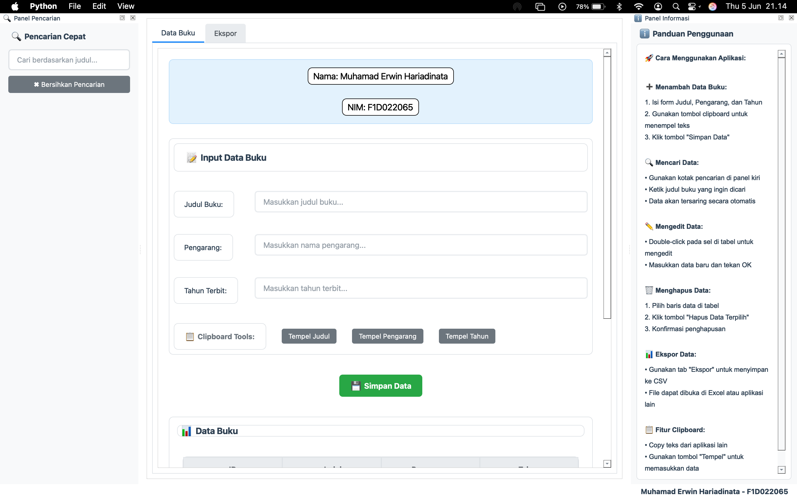
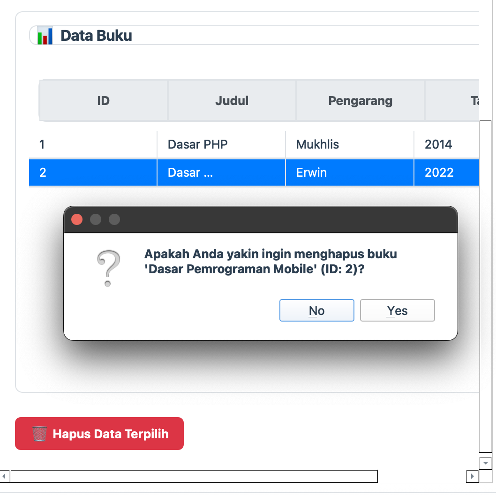
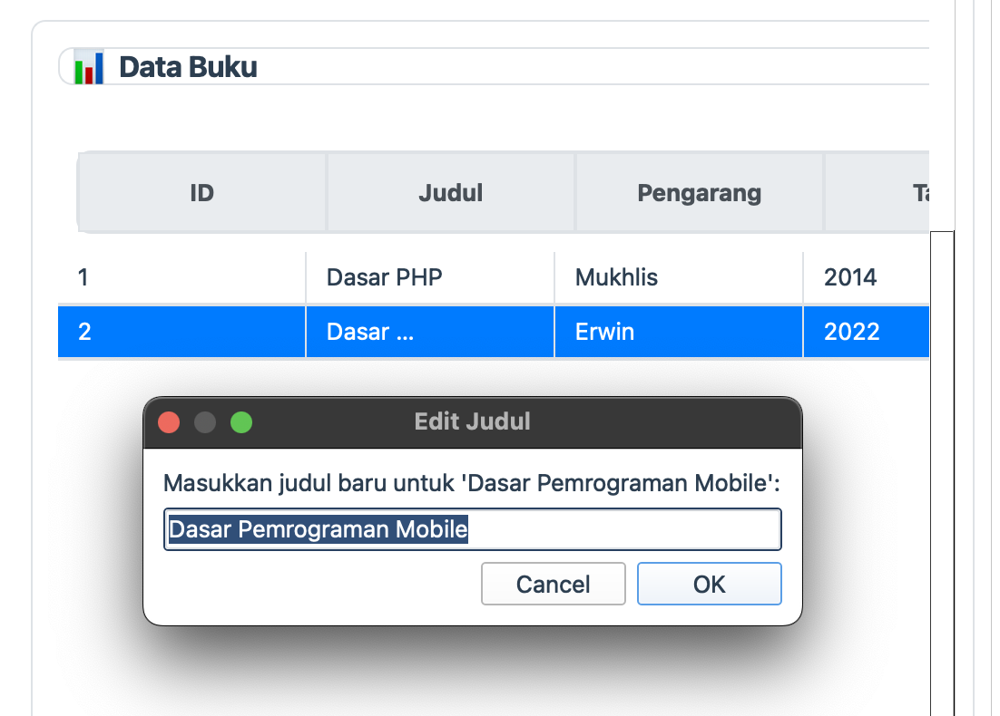
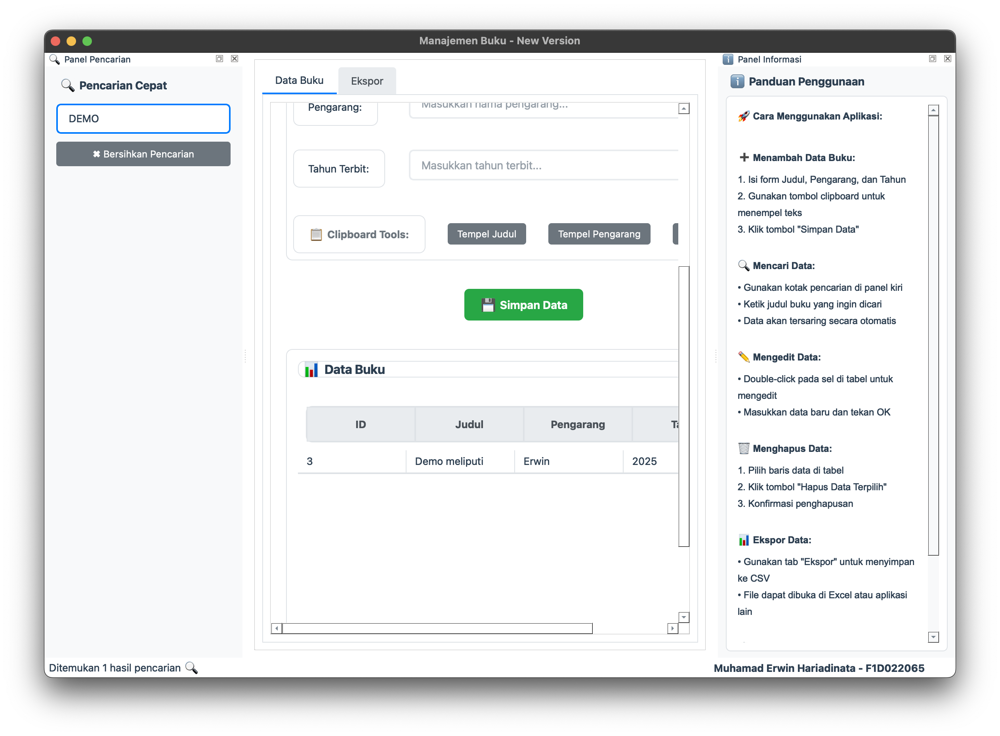
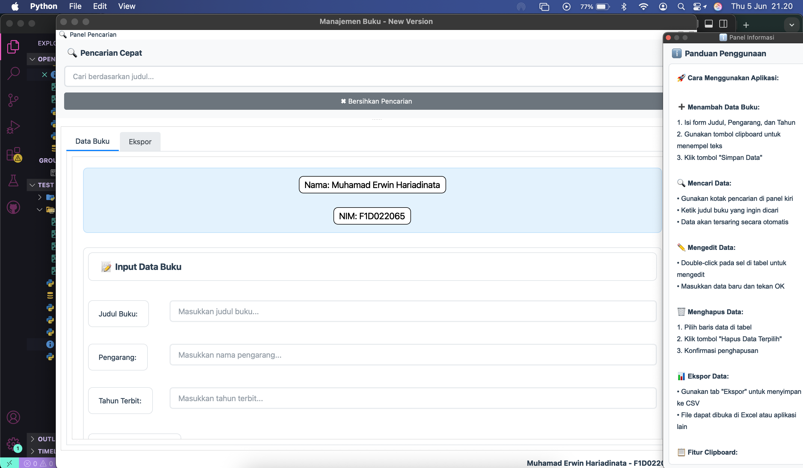
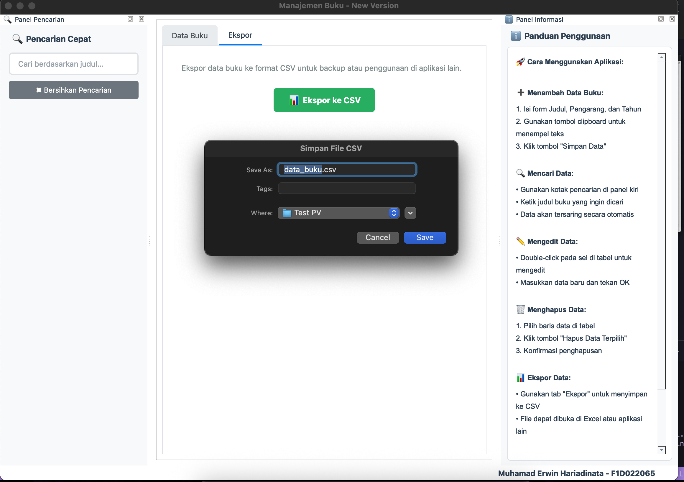

# Manajemen Buku - New Version

## Deskripsi Singkat
**Manajemen Buku - New Version** adalah aplikasi desktop yang dikembangkan untuk mempermudah pengelolaan data koleksi buku. Aplikasi ini menyediakan antarmuka yang ramah pengguna untuk melakukan operasi standar seperti menambah, melihat, mengedit, mencari, menghapus, dan mengekspor data buku.

Dibuat dengan Python dan framework PyQt6 untuk antarmuka grafis, serta menggunakan SQLite sebagai basis data lokal.

## Fitur Utama
* **Manajemen Data Buku (CRUD):**
    * Menambah buku baru (Judul, Pengarang, Tahun Terbit).
    * Menampilkan data buku dalam tabel yang informatif.
    * Mengedit detail buku melalui klik ganda pada sel tabel.
    * Menghapus buku yang dipilih dari database.
* **Pencarian Dinamis:** Fitur pencarian cepat berdasarkan judul buku.
* **Ekspor Data:** Mengekspor seluruh data buku ke format file CSV.

### Implementasi Fitur Khusus (Sesuai Materi Perkuliahan):

* **Integrasi Clipboard (`QClipboard` – Materi Minggu ke-11):**
    * Memanfaatkan `QClipboard` untuk interaksi dengan clipboard sistem.
    * Terdapat tombol **"Tempel Judul"**, **"Tempel Pengarang"**, dan **"Tempel Tahun"** yang memungkinkan pengguna untuk menempelkan teks dari aplikasi eksternal (misalnya, Word, Notepad, browser) langsung ke field input yang sesuai.
    * Menu "Edit" -> **"Tempel dari Clipboard"** juga tersedia untuk menempelkan data buku gabungan (misalnya, format "Judul|Pengarang|Tahun").

* **Panel Dock (`QDockWidget` – Materi Minggu ke-11):**
    * Menggunakan `QDockWidget` untuk komponen aplikasi yang fleksibel.
    * **Panel Pencarian:** Berisi input field untuk mencari buku, dapat dilepas (detachable) dan dipindahkan (movable) oleh pengguna.
    * **Panel Informasi:** Menampilkan panduan penggunaan aplikasi, juga sebagai dock widget yang detachable dan movable.
    * Visibilitas kedua panel ini dapat diatur melalui menu "View".

* **Status Bar (`QStatusBar` – Materi Minggu ke-12):**
    * Menampilkan **Nama dan NIM Pengembang** (`Muhamad Erwin Hariadinata - F1D022065`) secara permanen di `QStatusBar` pada bagian bawah window.
    * Status bar juga digunakan untuk menampilkan pesan status operasional aplikasi kepada pengguna.

* **Area Gulir (`QScrollArea` – Materi Minggu ke-13):**
    * **Tabel Data (`QTableWidget`):** Secara otomatis mendukung scrolling vertikal dan horizontal ketika jumlah data melebihi area tampilan yang tersedia (fungsionalitas bawaan `QTableWidget`).
    * **Form Input dan Konten Tab:** Seluruh area konten utama pada tab "Data Buku" (termasuk form input dan tabel) dibungkus dalam `QScrollArea` (`main_scroll` dan `data_scroll` secara bertingkat). Ini memastikan bahwa jika tinggi window tidak mencukupi atau kontennya banyak, pengguna tetap dapat menggulir untuk mengakses semua elemen.

## Teknologi yang Digunakan
* **Bahasa Pemrograman:** Python 3
* **GUI Framework:** PyQt6
* **Database:** SQLite 3 (file: `books.db`)
* **Styling:** Qt Style Sheets (QSS) dengan basis style "Fusion".

## Struktur File Proyek
* `app.py`: Titik masuk utama aplikasi (main script).
* `main_window.py`: Kelas `BookManager` (QMainWindow) yang menangani logika UI.
* `database_handler.py`: Kelas `DatabaseHandler` untuk semua operasi database SQLite.
* `styles.py`: Kelas `Styles` untuk semua definisi QSS.
* `config.py`: Menyimpan konstanta dan konfigurasi aplikasi.
* `books.db`: File database SQLite (dibuat otomatis).

## Persyaratan Sistem
* Python 3.x
* PyQt6
    ```bash
    pip install PyQt6
    ```

## Cara Menjalankan Aplikasi
1.  Pastikan Python 3 dan PyQt6 sudah terinstal.
2.  Unduh semua file proyek ke dalam satu direktori.
3.  Buka terminal/command prompt, navigasi ke direktori proyek.
4.  Jalankan dengan perintah:
    ```bash
    python app.py
    ```
5.  File `books.db` akan dibuat otomatis jika belum ada.

## Informasi Pengembang
* **Nama:** Muhamad Erwin Hariadinata
* **NIM:** F1D022065

## Screenshot
**Tampilan Utama:**


**Tampilan Utama Menampilkan Data Buku:**


**Tampilan Menghapus Buku:**


**Tampilan Mengedit Buku:**


**Tampilan Ketika Melakukan Pencarian:**


**Tampilan Dock Widget:**


**Tampilan Ekspor File:**
