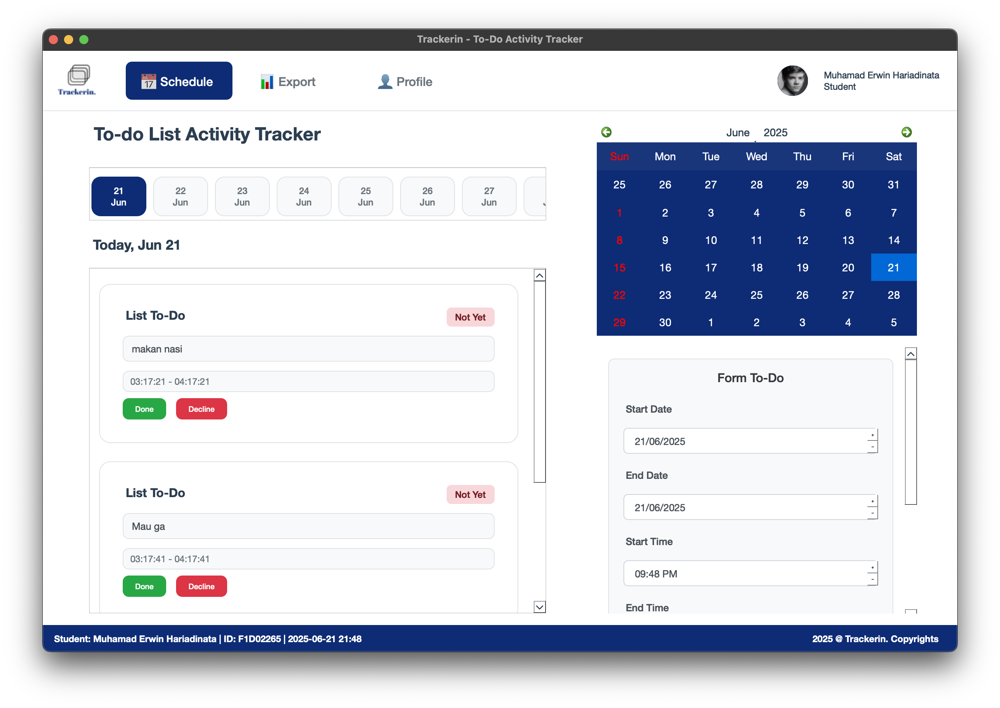
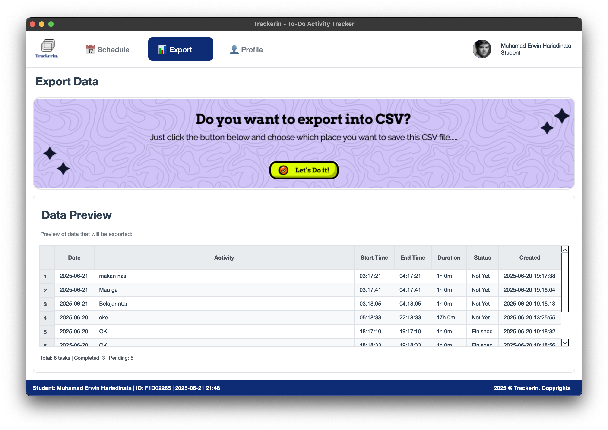
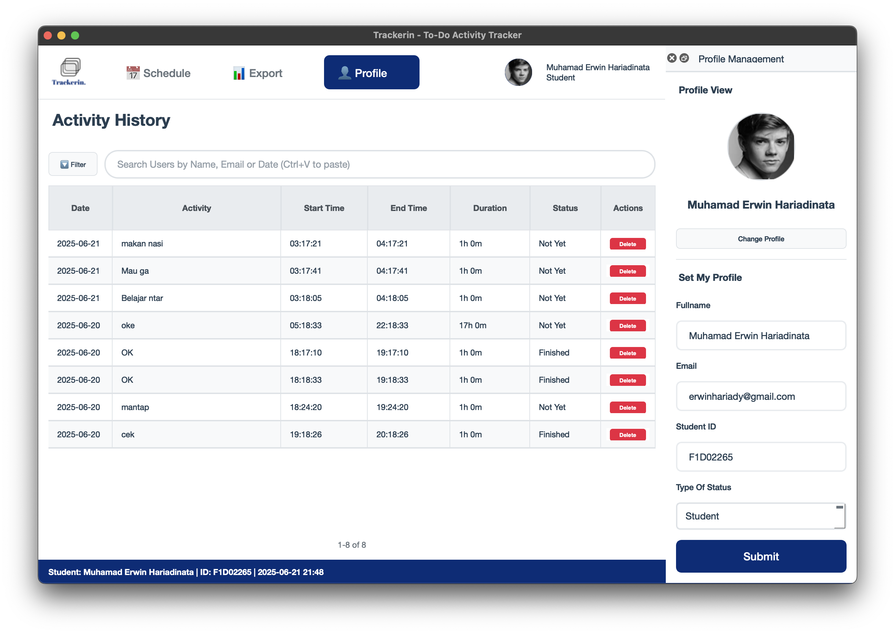
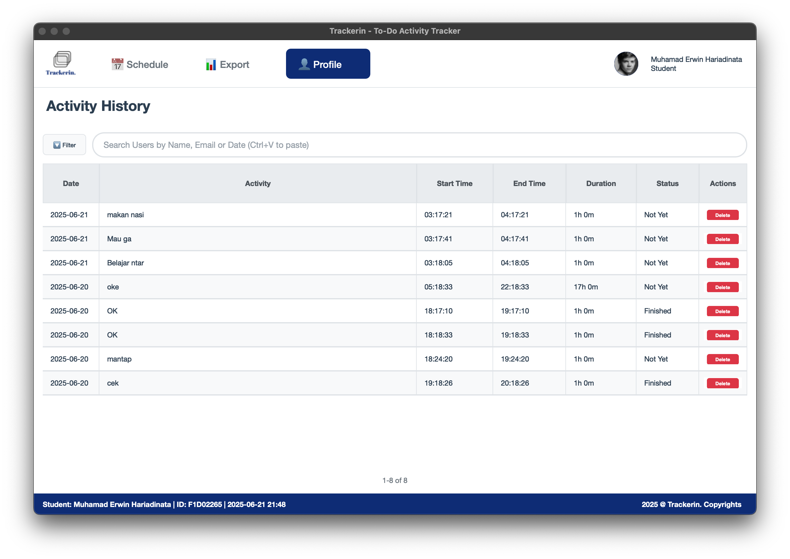
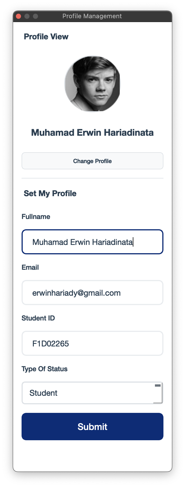
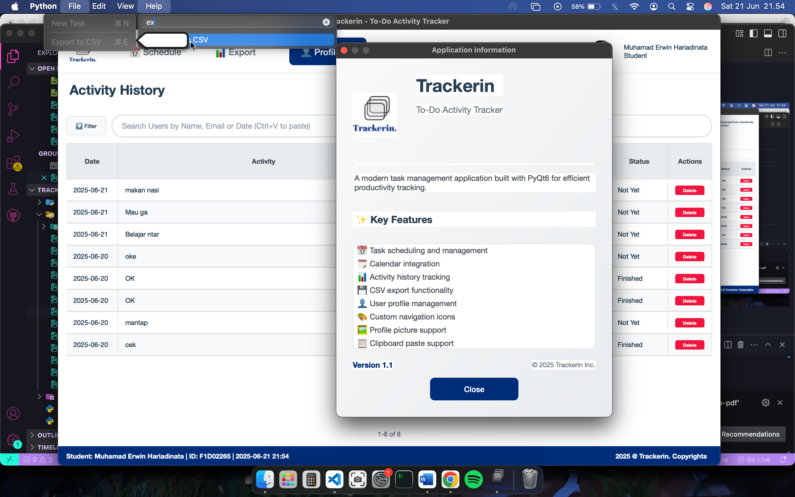
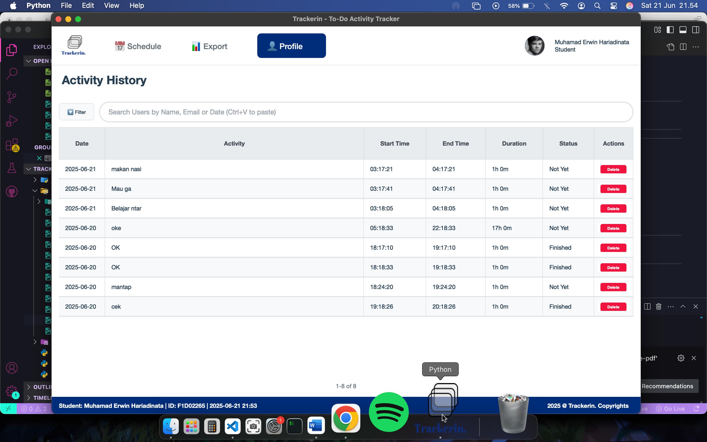

# LAPORAN PROYEK APLIKASI TRACKERIN
## To-Do Activity Tracker dengan PyQt6

---

**Nama Aplikasi:** Trackerin - To-Do Activity Tracker  
**Framework:** PyQt6  
**Database:** SQLite  
**Bahasa Pemrograman:** Python 3.8+  
**Platform:** Cross-platform (Windows, macOS, Linux)  

**Tanggal Pembuatan:** 2025  
**Developer:** Muhamad Erwin Hariadinata | F1D022065 

---

## 📋 DAFTAR ISI

1. [Deskripsi Aplikasi](#1-deskripsi-aplikasi)
2. [Langkah-langkah Pembuatan Proyek](#2-langkah-langkah-pembuatan-proyek)
3. [Penjelasan Fungsi Utama](#3-penjelasan-fungsi-utama)
4. [Arsitektur dan Komponen](#4-arsitektur-dan-komponen)
5. [Interface dan Fungsionalitas](#5-interface-dan-fungsionalitas)
6. [Implementasi Database](#6-implementasi-database)
7. [Styling dan User Experience](#7-styling-dan-user-experience)
8. [Testing dan Debugging](#8-testing-dan-debugging)
9. [Kesimpulan dan Future Development](#9-kesimpulan-dan-future-development)

---

## 1. DESKRIPSI APLIKASI

### 1.1 Overview Aplikasi

Trackerin adalah aplikasi desktop modern yang dirancang untuk membantu pengguna dalam mengelola aktivitas dan tugas harian mereka. Aplikasi ini dibangun menggunakan PyQt6 framework untuk memberikan pengalaman user interface yang intuitif dan responsif.

### 1.2 Tujuan Pembuatan

**Primary Goals:**
- Menyediakan platform terpusat untuk task management
- Meningkatkan produktivitas pengguna dengan interface yang user-friendly
- Memberikan fitur tracking dan reporting yang comprehensive
- Mendukung workflow harian dengan integrasi calendar

**Target Users:**
- Students untuk mengatur jadwal belajar dan tugas
- Professionals untuk mengelola project dan deadline
- Individuals yang ingin meningkatkan personal productivity

### 1.3 Fitur Utama

**📅 Schedule Management**
- Task creation dengan date dan time scheduling
- Visual calendar integration untuk date selection
- Day selector untuk quick navigation
- Status tracking (Not Yet/Finished)

**👤 Profile Management**
- User profile dengan photo upload
- Personal information management
- Activity history tracking
- Search dan filter capabilities

**📊 Data Export & Analytics**
- CSV export functionality
- Data preview dengan statistics
- Duration calculation otomatis
- Comprehensive reporting

**🎨 Modern User Interface**
- Clean dan professional design
- Custom navigation icons
- Responsive layout design
- Dock widgets untuk advanced features

---

## 2. LANGKAH-LANGKAH PEMBUATAN PROYEK

### 2.1 Planning dan Design Phase

**Step 1: Requirements Analysis**
```
Analisis kebutuhan user:
- Task management dengan scheduling
- User profile management
- Data export capabilities
- Cross-platform compatibility
```

**Step 2: Technology Stack Selection**
```
Framework: PyQt6 (untuk modern GUI development)
Database: SQLite (lightweight, embedded database)
Styling: Custom CSS-like styling dengan PyQt6
```

**Step 3: Database Design**
```sql
-- Tabel utama yang dirancang:
tasks: id, title, description, start_date, end_date, start_time, end_time, status
user_profile: id, fullname, email, student_id, status_type, profile_picture
```

### 2.2 Development Phase

**Step 4: Project Structure Setup**
```
trackerin/
├── main.py              # Entry point aplikasi
├── main_window.py       # Main window management
├── database.py          # Database operations
├── schedule_page.py     # Schedule management page
├── profile_page.py      # Profile dan history page
├── export_page.py       # Data export page
├── styles.py           # Centralized styling
└── assets/             # Images dan icons
    ├── logo.png
    ├── Frame 182.png
    └── icons/
```

**Step 5: Core Components Development**

*Database Layer Implementation:*
```python
class DatabaseHandler:
    def __init__(self, db_path: str = "trackerin.db"):
        self.db_path = db_path
        self.init_database()
    
    def init_database(self):
        # Create tables dan default data
    
    def add_task(self, title, description, start_date, end_date, start_time, end_time):
        # CRUD operations untuk tasks
```

*Main Window Architecture:*
```python
class MainWindow(QMainWindow):
    def __init__(self):
        # Initialize database, UI components, navigation system
    
    def init_ui(self):
        # Setup layout, header, stacked widgets untuk pages
```

**Step 6: Page Components Development**

*Schedule Page Implementation:*
- TaskCard component untuk individual tasks
- Day selector dengan horizontal scrolling
- Calendar widget integration
- Form input dengan validation

*Profile Page Implementation:*
- Activity history table dengan sorting
- Search dan filter functionality
- Inline editing capabilities
- Profile dock untuk management

*Export Page Implementation:*
- Data preview table
- CSV export dengan file dialog
- Statistics calculation
- Error handling untuk export process

### 2.3 Integration dan Testing Phase

**Step 7: Component Integration**
```python
# Signal-slot communication setup
self.task_updated.connect(self.refresh_tasks)
self.profile_updated.connect(self.refresh_header_profile)

# Database integration across all components
self.schedule_page = SchedulePage(self.db)
self.export_page = ExportPage(self.db)
self.profile_page = ProfilePage(self.db)
```

**Step 8: Styling dan UI Polish**
- Centralized styling system dengan styles.py
- Color scheme consistency
- Responsive layout adjustments
- Custom icons implementation

**Step 9: Error Handling dan Validation**
- Comprehensive try-catch blocks
- Input validation untuk forms
- Database error handling
- File operation safety checks

---

## 3. PENJELASAN FUNGSI UTAMA

### 3.1 Database Management Functions

**`DatabaseHandler` Class - Core Database Operations**

```python
def add_task(self, title: str, description: str, start_date: str, 
             end_date: str, start_time: str, end_time: str) -> bool:
    """
    Fungsi untuk menambah task baru ke database
    
    Parameters:
    - title: Judul aktivitas
    - description: Deskripsi detail
    - start_date/end_date: Tanggal dalam format YYYY-MM-DD
    - start_time/end_time: Waktu dalam format HH:MM:SS
    
    Returns: Boolean success status
    
    Implementation:
    - Validasi input parameters
    - Insert ke table tasks dengan auto-increment ID
    - Error handling dengan SQLite exceptions
    """
```

```python
def get_tasks_by_date(self, date: str) -> List[Dict]:
    """
    Mengambil semua tasks untuk tanggal tertentu
    
    Features:
    - Sorting: Finished tasks di bawah, kemudian by start_time
    - Return format: List of dictionaries dengan complete task data
    - Used by: Schedule page untuk daily view
    """
```

```python
def update_task_status(self, task_id: int, status: str) -> bool:
    """
    Update status task (Not Yet/Finished)
    
    Usage: TaskCard component untuk mark as done functionality
    Triggers: UI refresh melalui signal-slot mechanism
    """
```

### 3.2 User Interface Management Functions

**`MainWindow` Class - Navigation dan Layout Management**

```python
def create_header(self, main_layout):
    """
    Membuat header bar dengan complete navigation system
    
    Components:
    - Logo aplikasi (dari assets/logo.png)
    - Navigation buttons (Schedule/Export/Profile)
    - User info display dengan profile picture
    - Custom icon loading dengan fallback system
    """
```

```python
def setup_navigation_button(self, button, icon_name: str, text: str, default_emoji: str):
    """
    Setup navigation button dengan advanced features
    
    Features:
    - Custom icon loading dari assets/icons/
    - State management (default/clicked icons)
    - Emoji fallback jika icons tidak tersedia
    - Hover effects dan checkable states
    """
```

```python
def safe_update_status_bar(self):
    """
    Update status bar dengan comprehensive error handling
    
    Information displayed:
    - Current time dengan auto-refresh
    - User information dari database
    - Copyright notice
    - Fallback data jika database error
    """
```

### 3.3 Task Management Functions

**`SchedulePage` Class - Core Scheduling Functionality**

```python
def create_day_selector(self, parent_layout):
    """
    Membuat horizontal scrollable day selector
    
    Features:
    - 14 hari ke depan dari hari ini
    - Checkable buttons dengan date/month display
    - Auto-scroll horizontal functionality
    - Integration dengan calendar widget
    """
```

```python
def add_task(self):
    """
    Handler untuk task creation dengan comprehensive validation
    
    Validation Rules:
    - Empty title check
    - Past date prevention
    - End date >= start date
    - End time > start time (same day)
    
    Process Flow:
    1. Input validation
    2. Database insertion
    3. Form reset
    4. UI refresh
    5. Success/error notification
    """
```

**`TaskCard` Component - Individual Task Display**

```python
def mark_as_done(self):
    """
    Mark task sebagai finished dengan UI updates
    
    Process:
    1. Update database status
    2. Update visual status badge
    3. Hide action buttons
    4. Emit signal untuk parent refresh
    5. Show success notification
    """
```

### 3.4 Profile Management Functions

**`ProfilePage` Class - Profile dan History Management**

```python
def edit_task_column(self, item: QTableWidgetItem):
    """
    Advanced inline editing dengan column-specific handling
    
    Supported Operations:
    - Activity name: Text input dengan validation
    - Start/End time: Time format validation (HH:MM:SS)
    - Status: Dropdown selection (Not Yet/Finished)
    - Date: Read-only dengan informational message
    
    Features:
    - Double-click activation
    - Input dialogs dengan pre-filled values
    - Real-time database updates
    - Error handling dengan user feedback
    """
```

```python
def load_profile_image(self, image_path: str):
    """
    Advanced image processing untuk profile pictures
    
    Process:
    1. Image loading dengan error handling
    2. Resize ke 100x100 pixels
    3. Circular cropping menggunakan QPainter
    4. Memory optimization
    5. Fallback ke emoji jika gagal
    
    Technical Implementation:
    - QPainter dengan antialiasing
    - QBrush untuk image masking
    - Transparent background handling
    """
```

### 3.5 Export dan Reporting Functions

**`ExportPage` Class - Data Export Management**

```python
def export_to_csv(self):
    """
    Comprehensive CSV export dengan advanced features
    
    Process Flow:
    1. Data validation (check for available tasks)
    2. File dialog dengan timestamp naming
    3. CSV writing dengan proper headers
    4. UTF-8 encoding untuk international characters
    5. Success dialog dengan file location info
    
    Export Fields:
    - Complete task information
    - Calculated duration
    - Timestamps
    - Status information
    """
```

```python
def calculate_duration(self, start_time: str, end_time: str) -> str:
    """
    Smart duration calculation dengan edge case handling
    
    Features:
    - Overnight task support (end < start)
    - Format output: "Xh Ym"
    - Error handling return "N/A"
    - Used across multiple components
    """
```

---

## 4. ARSITEKTUR DAN KOMPONEN

### 4.1 Component Hierarchy

```
QApplication (main.py)
└── MainWindow (main_window.py)
    ├── Header Bar
    │   ├── Logo
    │   ├── Navigation Buttons
    │   └── User Info Display
    ├── QStackedWidget (Page Container)
    │   ├── SchedulePage
    │   │   ├── Day Selector
    │   │   ├── Task Cards Area
    │   │   ├── Calendar Widget
    │   │   └── Input Form
    │   ├── ProfilePage
    │   │   ├── Activity Table
    │   │   ├── Search Controls
    │   │   └── Profile Dock Content
    │   └── ExportPage
    │       ├── Export Section
    │       └── Preview Table
    ├── Menu Bar
    ├── Status Bar
    └── Profile Dock Widget
```

### 4.2 Data Flow Architecture

**Task Creation Flow:**
```
User Input (Form) → Validation → Database Insert → UI Refresh → Notification
```

**Task Status Update Flow:**
```
User Action (TaskCard) → Database Update → Signal Emission → Parent Refresh → UI Update
```

**Profile Update Flow:**
```
Profile Form → Validation → Database Update → Signal Emission → Header Refresh → Status Bar Update
```

### 4.3 PyQt6 Components Integration

**Core Components:**

| Component | Purpose | Implementation |
|-----------|---------|----------------|
| QApplication | Application entry point | main.py - event loop management |
| QMainWindow | Main application window | main_window.py - menu/status bar |
| QStackedWidget | Page navigation | main_window.py - page switching |
| QDockWidget | Profile panel | main_window.py - dockable sidebar |
| QTableWidget | Data display | profile_page.py, export_page.py |
| QCalendarWidget | Date selection | schedule_page.py - visual calendar |
| pyqtSignal | Inter-component communication | Custom signals untuk real-time updates |

---

## 5. INTERFACE DAN FUNGSIONALITAS

### 5.1 Main Window Interface

**Header Section:**
- **Logo Area**: Trackerin brand logo dengan fallback emoji
- **Navigation Bar**: 
  - Schedule button (📅 dengan custom icon support)
  - Export button (📊 dengan custom icon support)  
  - Profile button (👤 dengan custom icon support)
- **User Info Panel**: 
  - Circular profile picture dengan real-time updates
  - User name dan status type display
  - Integration dengan profile data

**Status Bar:**
- **Left Section**: Student information dengan auto-refresh
- **Right Section**: Copyright notice
- **Auto-Update**: Setiap menit via QTimer

### 5.2 Schedule Page Interface

**Day Selector Section:**
```
[Today] [22] [23] [24] [25] [26] [27] [28] ...
       Jun  Jun  Jun  Jun  Jun  Jun  Jun
```
- Horizontal scrollable buttons
- Current date highlighting
- Quick date navigation
- Visual feedback pada selection

**Task Cards Display:**
```
┌─────────────────────────────────────────────┐
│ List To-Do                    [Not Yet]     │
│                                             │
│ Belajar PyQt6 untuk Final Project          │
│                                             │
│ 09:00 AM - 11:00 AM                        │
│                                             │
│ [Done]  [Decline]                          │
└─────────────────────────────────────────────┘
```

**Calendar Widget:**
- Interactive date selection
- Weekend highlighting (red Sundays)
- Integration dengan day selector
- Visual feedback untuk selected date

**Input Form:**
```
Form To-Do
┌─────────────────────────────┐
│ Start Date: [2025-06-21] ▼ │
│ End Date:   [2025-06-21] ▼ │
│ Start Time: [09:00 AM]   ▼ │
│ End Time:   [11:00 AM]   ▼ │
│ Activity:   [____________] │
│                           │
│         [Submit]          │
└─────────────────────────────┘
```

### 5.3 Profile Page Interface

**Activity History Table:**
```
┌──────────┬─────────────────┬──────────┬──────────┬──────────┬────────────┬─────────┐
│   Date   │    Activity     │Start Time│ End Time │ Duration │   Status   │ Actions │
├──────────┼─────────────────┼──────────┼──────────┼──────────┼────────────┼─────────┤
│2025-06-21│ Belajar PyQt6   │  09:00   │  11:00   │   2h 0m  │ [Finished] │[Delete] │
│2025-06-20│ Meeting Project │  14:00   │  15:30   │   1h 30m │ [Not Yet]  │[Delete] │
└──────────┴─────────────────┴──────────┴──────────┴──────────┴────────────┴─────────┘
```

**Search dan Filter Controls:**
```
[🔽 Filter]  [________________________Search Users________________________]
```

**Profile Dock Panel:**
```
Profile View
┌─────────────────┐
│                 │
│    [👤 Photo]   │  ← Circular profile picture
│                 │
└─────────────────┘
    User Name
[Change Profile]

Set My Profile
┌─────────────────┐
│ Fullname: [...] │
│ Email: [...]    │
│ Student ID:[...] │
│ Status: [▼]     │
│    [Submit]     │
└─────────────────┘
```

### 5.4 Export Page Interface

**Export Section:**
```
┌─────────────────────────────────────────────────────────────┐
│                                                             │
│              Background Image/Gradient                      │
│                                                             │
│                    [✓ Let's Do it!]                        │
│                                                             │
└─────────────────────────────────────────────────────────────┘
```

**Data Preview Table:**
```
Data Preview
Preview of data that will be exported:

┌──────────┬─────────────────┬──────────┬──────────┬──────────┬────────────┬───────────┐
│   Date   │    Activity     │Start Time│ End Time │ Duration │   Status   │  Created  │
├──────────┼─────────────────┼──────────┼──────────┼──────────┼────────────┼───────────┤
│2025-06-21│ Belajar PyQt6   │  09:00   │  11:00   │   2h 0m  │ [Finished] │2025-06-21 │
└──────────┴─────────────────┴──────────┴──────────┴──────────┴────────────┴───────────┘

Total: 15 tasks | Completed: 8 | Pending: 7
```

### 5.5 Interactive Features

**Double-Click Editing:**
- Click pada Activity cell → Text input dialog
- Click pada Time cells → Time format validation
- Click pada Status cell → Dropdown selection
- Real-time database updates

**Drag dan Drop Support:**
- Profile picture upload via file dialog
- Multiple file format support (PNG, JPG, JPEG, GIF, BMP)

**Keyboard Shortcuts:**
- Ctrl+N: New task (focus ke activity input)
- Ctrl+E: Export page
- Ctrl+V: Paste clipboard content
- Ctrl+Q: Exit application
- F1: About dialog

**Signal-Slot Communications:**
```python
# Real-time updates tanpa page refresh
task_updated.connect(refresh_tasks)
profile_updated.connect(refresh_header_profile)
date_changed.connect(update_form_dates)
```

---

## 6. IMPLEMENTASI DATABASE

### 6.1 Database Schema Design

**Table: tasks**
```sql
CREATE TABLE tasks (
    id INTEGER PRIMARY KEY AUTOINCREMENT,
    title TEXT NOT NULL,
    description TEXT,
    start_date DATE NOT NULL,
    end_date DATE,
    start_time TIME NOT NULL,
    end_time TIME NOT NULL,
    status TEXT DEFAULT 'Not Yet',
    created_at TIMESTAMP DEFAULT CURRENT_TIMESTAMP,
    updated_at TIMESTAMP DEFAULT CURRENT_TIMESTAMP
);
```

**Table: user_profile**
```sql
CREATE TABLE user_profile (
    id INTEGER PRIMARY KEY AUTOINCREMENT,
    fullname TEXT NOT NULL,
    email TEXT,
    student_id TEXT,
    status_type TEXT DEFAULT 'Student',
    profile_picture TEXT,
    created_at TIMESTAMP DEFAULT CURRENT_TIMESTAMP,
    updated_at TIMESTAMP DEFAULT CURRENT_TIMESTAMP
);
```

### 6.2 CRUD Operations Implementation

**Create Operations:**
```python
def add_task(self, title, description, start_date, end_date, start_time, end_time):
    try:
        with sqlite3.connect(self.db_path) as conn:
            cursor = conn.cursor()
            cursor.execute('''
                INSERT INTO tasks (title, description, start_date, end_date, start_time, end_time)
                VALUES (?, ?, ?, ?, ?, ?)
            ''', (title, description, start_date, end_date, start_time, end_time))
            conn.commit()
            return True
    except sqlite3.Error as e:
        print(f"Error adding task: {e}")
        return False
```

**Read Operations dengan Advanced Sorting:**
```python
def get_tasks_by_date(self, date):
    cursor.execute('''
        SELECT id, title, description, start_date, end_date, start_time, end_time, status
        FROM tasks 
        WHERE start_date = ? 
        ORDER BY 
            CASE status 
                WHEN 'Finished' THEN 0 
                ELSE 1 
            END,
            start_time
    ''', (date,))
```

**Update Operations dengan Timestamp:**
```python
def update_task_status(self, task_id, status):
    cursor.execute('''
        UPDATE tasks 
        SET status = ?, updated_at = CURRENT_TIMESTAMP 
        WHERE id = ?
    ''', (status, task_id))
```

**Search Operations dengan LIKE Pattern:**
```python
def search_tasks(self, search_term):
    cursor.execute('''
        SELECT id, title, description, start_date, end_date, start_time, end_time, status, created_at
        FROM tasks 
        WHERE title LIKE ? OR description LIKE ?
        ORDER BY start_date DESC, start_time
    ''', (f'%{search_term}%', f'%{search_term}%'))
```

### 6.3 Database Connection Management

**Connection Pooling dengan Context Manager:**
```python
def safe_database_operation(self, operation_func):
    try:
        with sqlite3.connect(self.db_path) as conn:
            cursor = conn.cursor()
            result = operation_func(cursor)
            conn.commit()
            return result
    except sqlite3.Error as e:
        print(f"Database error: {e}")
        return None
```

**Transaction Management:**
```python
# Automatic transaction handling dengan try-catch
# Rollback otomatis jika error
# Connection cleanup dengan context manager
```

### 6.4 Data Validation dan Integrity

**Input Validation:**
- Date format validation (YYYY-MM-DD)
- Time format validation (HH:MM:SS)
- Required field checks
- SQL injection prevention dengan prepared statements

**Business Logic Validation:**
- Past date prevention untuk new tasks
- End date >= start date validation
- Time logic validation (end time > start time)
- Duplicate prevention untuk critical data

---

## 7. STYLING DAN USER EXPERIENCE

### 7.1 Design System

**Color Palette:**
```python
COLORS = {
    'primary': '#0E2C75',           # Professional blue
    'secondary': '#f8f9fa',         # Light gray background
    'success': '#28a745',           # Green untuk success states
    'danger': '#dc3545',            # Red untuk delete/error
    'warning': '#ffc107',           # Yellow untuk warnings
    'text_primary': '#2c3e50',      # Dark text
    'text_secondary': '#6c757d',    # Light text
    'border': '#dee2e6',            # Subtle borders
    'finished_bg': '#d4edda',       # Green background untuk completed
    'not_yet_bg': '#f8d7da',        # Red background untuk pending
}
```

**Typography System:**
- **Headers**: Bold, larger font sizes untuk titles
- **Body Text**: Regular weight, optimal line height
- **Platform Fonts**: 
  - macOS: Helvetica Neue → Arial → System
  - Windows: Segoe UI → Arial
  - Linux: Ubuntu → DejaVu Sans → Arial

### 7.2 Component Styling

**Navigation Buttons:**
```python
QPushButton#navButton {
    background-color: transparent;
    border: none;
    color: #6c757d;
    font-size: 16px;
    font-weight: 500;
    padding: 12px 20px;
    margin: 5px;
    border-radius: 8px;
    min-width: 100px;
}

QPushButton#navButton:hover {
    background-color: #f8f9fa;
    color: #2c3e50;
}

QPushButton#navButton:checked {
    background-color: #0E2C75;
    color: #ffffff;
}
```

**Task Cards:**
```python
QFrame#taskCard {
    background-color: #ffffff;
    border: 1px solid #dee2e6;
    border-radius: 15px;
    padding: 15px;
    margin: 8px 0;
}
```

**Tables dengan Alternate Row Colors:**
```python
QTableWidget {
    gridline-color: #dee2e6;
    background-color: #ffffff;
    alternate-background-color: #f8f9fa;
    border: none;
}
```

### 7.3 Responsive Design

**Layout Adaptivity:**
- Fixed width untuk main components (consistency)
- Flexible height dengan scroll areas
- Minimum window size constraints
- Proper widget spacing dan margins

**Content Scaling:**
- Icon scaling berdasarkan widget size
- Font scaling untuk different screen densities
- Image processing dengan aspect ratio preservation

### 7.4 User Experience Enhancements

**Visual Feedback:**
- Hover effects pada interactive elements
- Loading states untuk database operations
- Color coding untuk status indicators
- Animation hints dengan CSS transitions

**Accessibility Features:**
- High contrast color combinations
- Keyboard navigation support
- Screen reader friendly markup
- Focus indicators yang jelas

**Error Prevention:**
- Input validation dengan real-time feedback
- Confirmation dialogs untuk destructive actions
- Undo capabilities dimana applicable
- Clear error messages dengan actionable solutions

---

## 8. Screenschot Aplikasi

**Tampilan Utama (Schedule):**


**Tampilan Export:**


**Tampilan Profile + DockWidget:**


**Tampilan Profile Full:**


**Tampilan Profile Dock Widget:**


**Tampilan Menu Bar:**


**Tampilan Logo Icon Ketika Aplikasi Di-Run:**


---

## 9. KESIMPULAN DAN FUTURE DEVELOPMENT

### 9.1 Project Summary

**Achievements:**
- ✅ **Functional Task Management System**: Complete CRUD operations untuk tasks
- ✅ **Modern User Interface**: PyQt6-based GUI dengan responsive design
- ✅ **Data Persistence**: SQLite database dengan robust error handling
- ✅ **Export Capabilities**: CSV export dengan comprehensive data
- ✅ **Profile Management**: User profiles dengan photo upload
- ✅ **Cross-Platform Compatibility**: Runs on Windows, macOS, dan Linux

**Technical Accomplishments:**
- **Signal-Slot Pattern**: Real-time UI updates tanpa tight coupling
- **Database Abstraction**: Centralized data operations
- **Error Handling**: Comprehensive exception management
- **Responsive Design**: Adaptive layouts untuk different screen sizes

### 9.2 Lessons Learned

**Development Insights:**
1. **PyQt6 Learning Curve**: Widget management dan styling memerlukan deep understanding
2. **Database Design**: Proper schema design crucial untuk performance
3. **Signal-Slot Communications**: Powerful untuk loose coupling tapi perlu careful management
4. **Error Handling**: Comprehensive error handling essential untuk user experience
5. **Testing Strategy**: Early testing prevents integration issues

**Technical Challenges Overcome:**
- **Image Processing**: Circular cropping dengan QPainter
- **Calendar Integration**: Multiple date selection methods synchronization
- **Table Management**: Dynamic content dengan custom widgets
- **File Operations**: Safe file handling dengan proper validation
- **Memory Management**: Proper widget cleanup dan resource management

### 9.3 Future Development Roadmap

**Version 1.2 - Enhanced UI/UX**
- 🔄 **Dark Mode Toggle**: Complete theme switching system
- 🔄 **Animation System**: Smooth transitions antara pages
- 🔄 **Notification System**: Desktop notifications untuk task reminders
- 🔄 **Drag & Drop**: Task reordering dan file upload improvements

**Version 1.3 - Advanced Features**
- 🔄 **Export Formats**: PDF, Excel, dan JSON export options
- 🔄 **Task Categories**: Color-coded task categorization
- 🔄 **Time Tracking**: Actual time spent vs estimated time
- 🔄 **Statistics Dashboard**: Advanced analytics dan charts

**Version 1.4 - Collaboration Features**
- 🔄 **Multi-User Support**: Shared tasks dan collaborative features
- 🔄 **Cloud Sync**: Data synchronization across devices
- 🔄 **API Integration**: Calendar sync (Google Calendar, Outlook)
- 🔄 **Team Management**: Group projects dan assignments

**Version 1.5 - Mobile Integration**
- 🔄 **Mobile Companion**: Android/iOS app untuk quick task entry
- 🔄 **Web Interface**: Browser-based access untuk remote usage
- 🔄 **REST API**: Backend API untuk third-party integrations
- 🔄 **Real-time Sync**: Live data synchronization
---

**AKHIR LAPORAN**

*Laporan ini mendokumentasikan complete development process dari Trackerin application, dari initial planning hingga final implementation. Project ini mendemonstrasikan successful integration dari modern Python technologies untuk create functional dan user-friendly desktop application.*

**Total Lines of Code:** ~2,500+ lines  
**Development Time:** Multiple development cycles  
**Technologies Used:** Python 3.8+, PyQt6, SQLite, CSS-like styling  
**Platform Support:** Windows, macOS, Linux  

---

*© 2025 Tim Trackerin - Muhamad Erwin Hariadinata | F1D022065